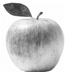

#OPENCV_電腦視覺庫. {ignore=true}
[toc]

## OPENCV簡介:
OpenCV的全稱是Open Source Computer Vision Library，是一個跨平台的電腦視覺庫。OpenCV是由英特爾公司發起並參與開發，以BSD授權條款授權發行，可以在商業和研究領域中免費使用。OpenCV可用於開發即時的圖像處理、電腦視覺以及圖型識別程式。該程式庫也可以使用英特爾公司的IPP進行加速處理。

OpenCV用C++語言編寫，它的主要介面也是C++語言，但是依然保留了大量的C語言介面。該庫也有大量的Python, Java and MATLAB/OCTAVE (版本2.5)的介面。這些語言的API介面函式可以透過線上文件取得。現在也提供對於C#,Ruby的支援。

所有新的開發和演算法都是用C++介面。一個使用CUDA的GPU介面也於2010年9月開始實現. 

Opencv的原始碼庫:  
<https://github.com/opencv/opencv>

可參考資料:
<https://docs.opencv.org/4.x/d9/df8/tutorial_root.html>
<https://docs.opencv.org/3.4/index.html>
<https://docs.opencv.org/3.4/d6/d00/tutorial_py_root.html>
使用opencv:雖然支援多種程式語言但以下以python為例:
- Visual studio: 按照函式庫安裝方法輸入pip install opencv-python。
- 數莓派: 在終端機上輸入sudo apt install python3-opencv。
- Heroku: pip install opencv-python-headless。
- OPENCV的進階套件(人臉辨識、物件追蹤時用):pip install opencv_contrib_python
- 函式庫的導入:import cv2


## 常用函式介紹:

### 讀取圖片imread():
&emsp;&emsp;讀取圖片通常採用cv2.imread()
&emsp;&emsp;用法:
```python
import cv2
#當影像和.py檔同目錄時:
img1=cv2.imread('apple.jpg')
#相對路徑:
img2=cv2.imread('data/apple.png')
#絕對路徑:
img3=cv2.imread('C:\Users\user\Desktop\apple.jpg')
#額外補充:
img4=cv2.imread('apple.jpg',cv2.IMREAD_GRAYSCALE)#載入影像自動轉灰階
img4=cv2.imread('apple.jpg',2)#同上用數字表示模式(完整如下表)
```
|數字|模式|說明|
|:-:|:-|:-|
|1|cv2.IMREAD_UNCHANGED|原本的圖像（ 如果圖像有 alpha 通道則會包含 )。|
2|cv2.IMREAD_GRAYSCALE|灰階圖像。|
3|cv2.IMREAD_COLOR BGR|彩色圖像。
4|cv2.IMREAD_ANYDEPTH|具有對應的深度時返回 16/32 位元圖像，否則將其轉換為 8 位元圖像。
5|cv2.IMREAD_ANYCOLOR|以任何可能的顏色格式讀取圖像。
6|cv2.IMREAD_LOAD_GDAL|使用 gdal 驅動程式加載圖像。
7|cv2.IMREAD_REDUCED_GRAYSCALE_2|灰階圖像，圖像尺寸減小 1/2。
8|cv2.IMREAD_REDUCED_COLOR_2|BGR 彩色圖像，圖像尺寸減小 1/2。
9|cv2.IMREAD_REDUCED_GRAYSCALE_4|灰階圖像，圖像尺寸縮小 1/4。
10|cv2.IMREAD_REDUCED_COLOR_4|BGR 彩色圖像，圖像尺寸減小 1/4。
11|cv2.IMREAD_REDUCED_GRAYSCALE_8|灰階圖像，圖像尺寸縮小 1/8。
12|cv2.IMREAD_REDUCED_COLOR_8|BGR 彩色圖像，圖像尺寸減小 1/8。
13|cv2.IMREAD_IGNORE_ORIENTATION|不要根據 EXIF 資訊的方向標誌旋轉圖像。

### 儲存圖片: imwrite()
&emsp;&emsp;儲存圖片通常使用cv2.imwrite()
&emsp;&emsp;用法:
```python
import cv2
#相對位置:
cv2.imwrite('apple.jpg',img)
cv2.imwrite('data/apple.jpg',img)
#絕對位置:
cv2.imwrite('C:\Users\user\Desktop\apple.jpg')
	
#若檔名為中文時，他會報錯，需要做解碼才能儲存
file_name='蘋果.jpg'#輸出檔案名稱
cv2.imwrite(file_name,img)
cv2.imencode('.jpg',img)[1].tofile(file_name)#檔案名解碼
```
### 顯示影像imshow():
&emsp;&emsp;用法:
```python
import cv2
#前面為視窗名稱，後面為要顯示的影像，多個視窗的時候不要用到相同名字
cv2.imshow('window1',img1)
cv2.imshow('window2',img2)
```
### 等待waitKey():
&emsp;&emsp;waitKey()，等待使用者對視窗做的動作
&emsp;&emsp;用法:
```python
import cv2
#等待2000ms後自動關閉cv2.imshow的視窗
cv2.waitKey(2000)
#無條件等待，對imshow的視窗按任意鍵他才會動作
cv2.waitKey(0)
#若使用者未按鍵盤，則繼續動作
cv2.waitKey(1)
#若使用者按下s鍵，保存影像
if cv2.waitKey(1)==ord('s'):
    cv2.imwrite('apple.jpg',img)
```
### 關閉所有cv2的視窗cv2.destroyAllWindows():
&emsp;&emsp;用法:
```python
import cv2
img1=cv2.imread('apple.jpg')
cv2.imshow('window1',img1)
cv2.waitKey(0)
cv2.destroyAllWindows()
```
### 使用影片或攝影鏡頭: VideoCapture()、release()、read()、VideoWriter():
&emsp;&emsp;使用:
```python
import cv2
cap = cv2.VideoCapture(0) # 讀取電腦攝影機鏡頭影像。
width = int(cap.get(cv2.CAP_PROP_FRAME_WIDTH)) # 取得影像寬度
	height = int(cap.get(cv2.CAP_PROP_FRAME_HEIGHT)) # 取得影像高度
	fourcc = cv2.VideoWriter_fourcc(*'MP4V') # (或用'M','P','4','V')設定影片的格式為 MP4V(補充資料如下)
	out = cv2.VideoWriter('av.mp4', fourcc, 20.0, (width, height)) # 產生空的影片(20.0為幀率fps)
	if not cap.isOpened():
	 	print("攝影機異常")
	 	exit()
	while True:
	 	ret, frame = cap.read()
	 	if not ret:
	 		print("攝影機無資料")
	 	break
	 	out.write(frame) # 將取得的每一幀圖像寫入空的影片
 	    cv2.imshow('video', frame)
	 	if cv2.waitKey(1) == ord('q'):
 		break # 按下 q 鍵停止
cap.release()# 關閉攝影機釋放資源
out.release() # 釋放資源
cv2.destroyAllWindows()
```
##### &emsp;&emsp;補充資料VideoWriter_fourcc(): {ignore=true}
```
1.表示未壓縮的 YUV 顏色編碼格示，副檔名為 .avi
    fourcc = cv2.VideoWriter_fourcc(*'I420')
2.表示 MPEG-4 編碼格示，副檔名為 .avi
    fourcc = cv2.VideoWriter_fourcc(*'XVID')
3.表示 MPEG-1 編碼格示，副檔名為 .avi
    fourcc = cv2.VideoWriter_fourcc(*'PIMT')
4.表示 MP4 編碼格示，副檔名為 .mp4
    fourcc = cv2.VideoWriter_fourcc(*'MP4V')	
5.表示 Ogg Vorbis 編碼格示，副檔名為 .ogv
    fourcc = cv2.VideoWriter_fourcc(*'THEO')	
6.表示 Flash 編碼格示，副檔名為 .flv
    fourcc = cv2.VideoWriter_fourcc(*'FLVI')
```
##### &emsp;&emsp;cap.get()可取得屬性: {ignore=true}
|編號|內容|編號|內容|
|:-:|-|:-:|-|
0|cv2.CAP_PROP_POS_MSEC<br/>影片目前播放的毫秒數。|1|cv2.CAP_PROP_POS_FRAMES<br/>從0開始的被截取或解碼的幀的索引值。|
2|cv2.CAP_PROP_POS_AVI_RATIO <br/>影片播放的相對位置，0表示開始，1表示結束。|3|cv2.CAP_PROP_FRAME_WIDTH<br/>影片宽度。|
4|cv2.CAP_PROP_FRAME_HEIGHT<br/>影片高度。|5|cv2.CAP_PROP_FPS<br/>影片幀率 fps。|
6|cv2.CAP_PROP_FOURCC<br/>編解碼的的四個字元。|7|cv2.CAP_PROP_FRAME_COUNT<br/>影片總共有幾幀。|
8|cv2.CAP_PROP_FORMAT<br/>影片格式。|9|cv2.CAP_PROP_MODE<br/>目前的截取模式。|
10|cv2.CAP_PROP_BRIGHTNESS<br/>攝影機亮度。|11|cv2.CAP_PROP_CONTRAST<br/>攝影機對比度。|
12|cv2.CAP_PROP_SATURATION<br/>攝影機飽和度。|13|cv2.CAP_PROP_HUE<br/>攝影機HUE色調數值。|
14|cv2.CAP_PROP_GAIN<br/>攝影機圖像增益數值。|15|cv2.CAP_PROP_EXPOSURE<br/>攝影機曝光度。|
16|cv2.CAP_PROP_CONVERT_RGB<br/>影片是否有轉換為RGB|		

### 顏色轉換cv2.cvtColor():
&emsp;&emsp;完整轉換方式清單網址:<https://docs.opencv.org/3.4/d8/d01/group__imgproc__color__conversions.html>
&emsp;&emsp;用法:
```python
import cv2
from matplotlib import pyplot as plt
#因為cv2以BGR型式處理影像，所以若用外部函式顯示輸出的圖片顏色會跑掉
img = cv2.imread("apple.jpg")
gray = cv2.cvtColor(img, cv2.COLOR_BGR2GRAY)#把BGR to gray
#因載入為BGR故需額外做轉換成RGB，才能使外部函式庫正常顯示
rgb = cv2.cvtColor(img, cv2.COLOR_BGR2RGB)#把BGR to RGB
hsv = cv2.cvtColor(img, cv2.COLOR_BGR2HSV)#把BGR to HSV(即色相、飽和度、明度)
plt.imshow(rgb)
plt.show()
cv2.imshow("windows", img)
cv2.imshow("gray", gray)
cv2.imshow("rgb", rgb) 
cv2.imshow("hsv", hsv)
	
cv2.waitKey(0)
cv2.destroyAllWindows()
```
&emsp;&emsp;輸出結果:
|/plt_rgb.png)<br/>plt顯示rgb|/cv2_rgb.png)<br/>cv2顯示rgb|/cv2_HSV.png)<br/>cv2顯示HSV|
|-|-|-|
|/cv2_gray.png)<br/>cv2顯示gray|/cv2_original.png)<br/>cv2顯示原圖|

### 取得影像資訊shape、size、dtype、split:
&emsp;&emsp;用法:
```python
import cv2
import numpy as np
img = cv2.imread('apple.jpg')
#取得影像的長、寬、通道數
sp=img.shape            # 得到 (寬,長,通道數(RGB))
print('影像的寬度='+str(sp[0]))
print('影像的長度='+str(sp[1]))
print('影像的通道數='+str(sp[2]))
#取得影像的總像素(長*寬*通道數)
pixel=img.size
print('影像的總像素='+str(pixel))
#取得數據類型
img_data_type=img.dtype
print('影像的數據類型為='+str(img_data_type))
#擷取影像的某些顏色(因為只有一條通道，所以為灰階的)
b,g, r = cv2.split(img)
cv2.imshow('blue_gray',b)
cv2.imshow('green_gray',g)
cv2.imshow('red_gray',r)
#擷取影像的某些顏色(3條通道)
img_blue = cv2.imread('apple.jpg')
img_green = cv2.imread('apple.jpg')
img_red = cv2.imread('apple.jpg')
img_blue[:,:,1] = 0    # 將綠色設為 0
img_blue[:,:,2] = 0    # 將紅色設為 0
img_green[:,:,0] = 0   # 將藍色設為 0
img_green[:,:,2] = 0   # 將紅色設為 0
img_red[:,:,0] = 0     # 將藍色設為 0
img_red[:,:,1] = 0     # 將綠色設為 0
cv2.imshow('blue', img_blue)
cv2.imshow('green', img_green)
cv2.imshow('red', img_red)
cv2.waitKey(0)
cv2.destroyAllWindows()
```
&emsp;&emsp;輸出結果:
&emsp;&emsp;影像的寬度=521、影像的長度=474、影像的通道數=3、影像的總像素=740862、影像的數據類型為=uint8
|<br/>blue_gray|<br/>green_gray|<br/>red_gray|
|:-:|:-:|:-:|
|<br/>blue|<br/>green|<br/>red|

### 影像的翻轉flip():
&emsp;&emsp;說明:
|數值|說明|
|:-:|-|
0|以 x 軸為中心上下翻轉。
1|以 y 軸為中心左右翻轉。
-1|同時進行上下左右翻轉。
&emsp;&emsp;用法:
```python
import cv2
img= cv2.imread('Chino.jpg')   # 開啟圖片
img_0 = cv2.flip(img, 0)    # 上下翻轉
img_1 = cv2.flip(img, 1)    # 左右翻轉
img_2 = cv2.flip(img, -1)   # 上下左右翻轉
cv2.imshow('img',img)
cv2.imshow('img_0', img_0)
cv2.imshow('img_1', img_1)
cv2.imshow('img_2', img_2)
cv2.waitKey(0)
cv2.destroyAllWindows()
```
&emsp;&emsp;輸出結果:
|<br/>原始|<br/>左右翻轉|
|:-:|:-:|
|<br/>上下翻轉|<br/>上下左右翻轉|

### 改變影像尺寸resize():
&emsp;&emsp;影像的縮放cv2.resize()，較常見也較簡單，cv2.resize(img,(寬度,高度))或cv2.resize(img, (640, 480),縮放方法)，其中縮放方法有許多，若沒特別設定預設為cv2.INTER_LINEAR雙線性插值，細節說明在後面。
&emsp;&emsp;用法:
```python
import cv2
img = cv2.imread("Chino.jpg")
#兩種較常用的圖片的縮放
img1 = cv2.resize(img,(256, 256))#雙線性插值(預設)
img2 = cv2.resize(img,(256, 256),interpolation=cv2.INTER_NEAREST)#最近鄰插值
img3 = cv2.resize(img,(256, 256),interpolation=cv2.INTER_AREA)#像素區域關係進行重采樣
cv2.imshow("img",img)
cv2.imshow("img1", img1)
cv2.imshow("img2", img2)
cv2.imshow("img3", img3)
cv2.waitKey(0)
cv2.destroyAllWindows()
```
#### 細節說明 {ignore=true}
1.**INTER_NEAREST**最近鄰插值
2.**INTER_LINEAR**雙線性插值(預設)
3.**INTER_AREA**像素區域關係進行重采樣
4.**INTER_CUBIC**雙三次插值
5.**INTER_LANCZOS4**Lanczos 插值
- 如果是要縮小圖片的話，通常**INTER_AREA**使用效果較佳。
- 如果是要放大圖片的話，通常**INTER_CUBIC**使用效果較佳，次等則是 **INTER_LINEAR**。
- 如果要追求速度的話，通常使用**INTER_NEAREST**。
- 由快到慢排序：INTER_NEAREST >INTER_CUBIC>INTER_LINEAR>INTER_AREA >INTER_LANCZOS4

**INTER_NEAREST最近鄰插值**:令原始圖像對應位置的色塊等比例放大或縮小後放到目標圖像縮放後的對應位置
&emsp;&emsp;算法:
&emsp;&emsp;&emsp;&emsp;$原始 X=目標 X \times (原始和目標圖像的縮放比例)$
&emsp;&emsp;&emsp;&emsp;$srcX=dstX \times (srcWidth/dstWidth)$
&emsp;&emsp;&emsp;&emsp;$srcY=dstY \times (srcHeight/dstHeight)$
&emsp;&emsp;&emsp;&emsp;$outputimg(dstX,dstY)=img(srcX,srcY)$
&emsp;&emsp;參考資料:<https://www.uj5u.com/qita/305312.html>

**INTER_LINEAR雙線性插值(預設)**:由原圖像位置在它附近的$2 \times 2$區域4個鄰近像素的值通過加權平均計算得出的
&emsp;&emsp;雙線性內插值算法放大後的圖像質量較高，不會出現像素值不連續的情況。然而此算法**具有低通濾波器的性質，使高頻分量受損，所以可能會使圖像輪廓在一定程度上變得模糊**。
&emsp;**算法:**
&emsp;&emsp;&emsp;先找出目標影像在原始圖像縮放後的對應位置，**0.5 是為了校正因為原點在(0,0)**
&emsp;&emsp;&emsp;$src_x = (dst_x+0.5) \times (src_w/dst_w) - 0.5$
&emsp;&emsp;&emsp;$src_y = (dst_y+0.5) \times (src_w/dst_w) - 0.5$
&emsp;&emsp;計算插值
&emsp;&emsp;&emsp;使之轉換成$img(i+u , j+v)$
&emsp;&emsp;&emsp;&emsp;$i, j = int(src_x),int(src_y)$
&emsp;&emsp;&emsp;&emsp;$u, v = src_x - i, src_y - j$
&emsp;&emsp;加權平均計算 4 個鄰近像素的值#上方用(1-u)下方用(u)，左方用(1-v)右方用(v)，
&emsp;&emsp;&emsp;$f(src_x,src_y) =$
&emsp;&emsp;&emsp;&emsp;$(1-u) \times (1-v) \times img[i,j]$&emsp;&emsp;**(左上)**
&emsp;&emsp;&emsp;&emsp;$+(1-u) \times v \times src[i,j+1]$&emsp;&emsp;**(右上)**
&emsp;&emsp;&emsp;&emsp;$+u \times (1-v) \times src[i+1,j] $&emsp;&emsp;**(左下)**
&emsp;&emsp;&emsp;&emsp;$+u \times v \times src[i+1,j+1]$&emsp;&emsp;**(右下)**
&emsp;&emsp;在對 f 做正規化(使他在 0~255)
&emsp;&emsp;插值:output(dst_x, dst_y) = f(src_x,src_y)
&emsp;&emsp;參考資料:<https://zh.wikipedia.org/zh-tw/双线性插值>

**INTER_AREA 使用像素區域關係進行重采樣**:對圖像相近色塊重複好幾次不同的濾波
&emsp;&emsp;參考資料:<https://zh.wikipedia.org/zh-hant/采样定理>

**INTER_CUBIC 4x4 像素鄰域的雙三次插值**:和雙線性插值類似但花費時間更久，品質更好，取附近 16 個像素做加權平均
&emsp;&emsp;p.s:BiCubic 基函式求出 16 個像素點的權重，加權不像雙線性插值哪樣單純
&emsp;&emsp;參考資料:<https://www.uj5u.com/qita/305312.html>
&emsp;&emsp;參考資料:<https://walkonnet.com/archives/466178>

**INTER_LANCZOS4(取附近 64 個像素做加權平均)**:省略


